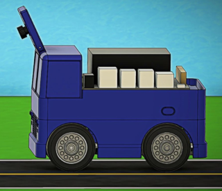

<h1 style="text-align: center;">JetCar</h1>
<h2 style="text-align: center;">The mini self-driving car project</h2>
 

  

 
The JetCar project is based on ideas from <a href="https://github.com/NVIDIA-AI-IOT/jetbot">JetBot</a> and <a href="https://github.com/NVIDIA-AI-IOT/jetracer">JetRacer</a>. It utilizes the <a href="https://developer.nvidia.com/embedded/jetson-nano-developer-kit">Jetson Nano Deveoper Kit</a>, the OLED display and battery pack from JetBot and the steering servo control from JetRacer. But this project includes a completely new mechanical design, as compact as possible with these components. 
The goal is not speed or road following alone, but navigating on a street map autonomously, recognizing intersections and turning left or right on user request when the turn is allowed. To do this, JetCar has to recognize intersections and a few signs on the street.
 

  

 
The project is organized into following folders:  

1. firmware
    - jetcar: Jupyter notebooks and python files to run in the JetCar
    - offline_debug: python files for offline debugging of firmware recordings
    - jetpack install script   

2. mechanical
    - step_files: all step files of the car design
    - stl_files: all stl files for 3D printer  

3. tools
    - bin: Windows executables
    - source: Full C# source code projects for the executables 
    - Jupyter notebook for training  

More documentation:
- [BOM](docs/BOM.md)
- [Assembly](docs/Assembly.md)
- [Firmware Setup](docs/Firmware%20Setup.md)
- [Data Preparation with ImageSegmenter](docs/Data%20Preparation.md)
- [Model Training](docs/Model%20Training.md)
- [Street Maker](docs/StreetMaker.md)

