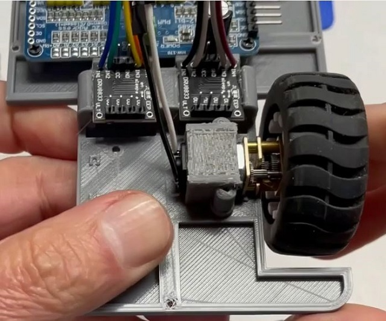
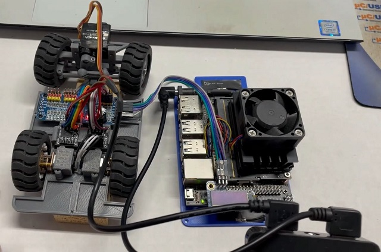
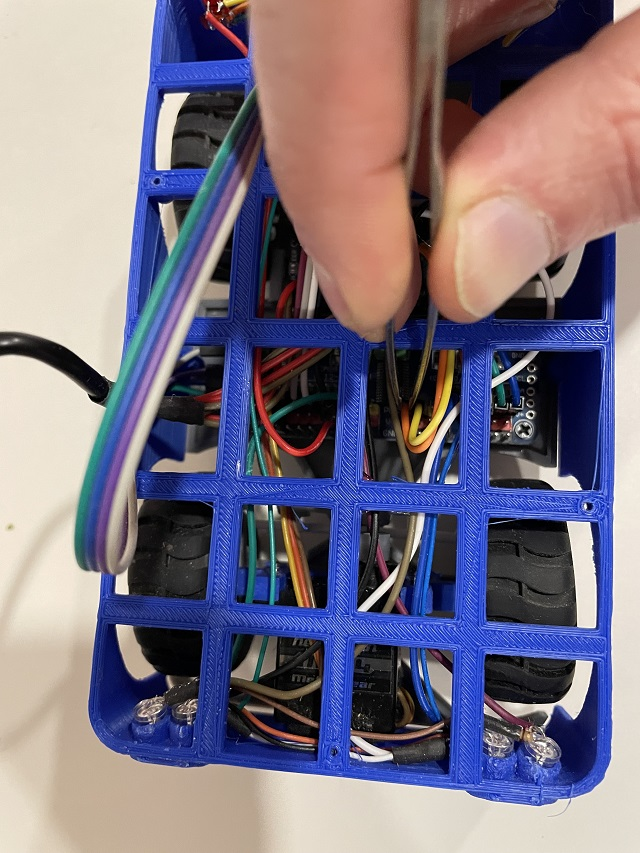

<h1 style="text-align: center;">JetCar</h1>
<h2 style="text-align: center;">Assembly</h2>
  
 
Get the parts from the 3D printer, remove the support layers and clean up the parts, sand them where necessary and make them smooth for assembly.
  
  
Start with the undercarriage and the steering parts. Place the wheel spindles on the undercarriage and make sure, they move and don't grind. File, sand or use drill bits where necessary to make them fit snug and smooth.
  
  
Place the steering rack part and the front axle part on top of the wheel spindles and make sure again, it moves smoothly.
  
  
Screw the front axle to the undercarriage with the taping screws. Check afterwards that the steering parts move smoothly.
  
  
Now, screw the servo controller to the undercarriage. Find more info about the servo controller here:  <a href="https://learn.adafruit.com/16-channel-pwm-servo-driver/downloads">Schematics</a> 
  
  
Solder wires with connectors to the motors and to the H-bridge boards and slide the H-bridges in place. <a href="https://www.ti.com/lit/ds/symlink/drv8833.pdf">Datasheet</a> 
  
  
Take the motors and put the original hubs and wheels on the shafts. Glue the hub caps to the outside for better looks.
  
  
Place motors and bracket on top of the undercarriage and fix the brackets with the tapping screws. Make sure, the outer metal gear plates end up in the small grooves of the undercarriage.
  
  
With both motors mounted it should look like this.
  
  
Since the steering does not work well with the original wheels, use the printed wheels and place the rubber tires on top of those. 
  
  
Use the M3 screws to fix the front wheels to the wheel spindles.
  
  
Here it is with all four wheels assembled.
  
  
Mount the servo arm to the servo. If you have a servo tester to center the servo first, then the screw can be tightened. Otherwise wait with tightening until the power up test later.
  
  
Mounte the servo with arm to the front axle using the tapping screws.
  
  
Mount the servo push rod by gently pressing it over the 2 balls of servo arm and steering rack until it snaps in.
  
  
This is the wiring diagram including optional LED lights. The pin assignment shown represents the current connections. But they can be completely re-arranged. If so, don't forget to change the channel definitions in <a href="https://github.com/StefansAI/JetCar/blob/main/firmware/jetcar/notebooks/jetcar_car.py">JetCar_Car.py</a>.
  
  
The right angle USB cable will be used as power cable.
  
  
Cut it at the end of the smaller connector.
  
  
Cut the data lines and leave only red (+) and black (-) wires. Solder 3 pairs of extensions for the servo driver board and the 2 H-bridge boards. Use shrink tube to isolate and stabilize the wires.
  
  
Plug in the wire connectors from the H-bridges to the servo board, the motor connectors to the H-bridge boards and the USB power cable connectors to all. (This picture does not match the wiring diagram above. It was a first test.)
  
  
To prepare the Jetson Nano board, remove the nano module with the heatsink and plug the Wi-Fi-board with the snapped in antennas in. Fix the Wi-Fi card with the original screw.
  
  
Snap the nano module back in place.
  
  
Mount the fan on top of the heatsink.
  
  
Solder the right angle header on the top side of the PiOLED display and plug it into the header connector of the Jetson Nano.
  
  
The I2C interface used for this OLED and the servo board is located at the last pins of this connector. Grab some wires and note the colors used at the pins.
  
  
Make sure it sits on the correct pins.
  
  
Connect to the correct I2C pins on the servo board.
  
  
Connect the 2 USB cables to the 2 battery ports and the system should start up for first testing. Make sure to have the micro SD card prepared correctly (see firmware setup) and inserted. The wheels should not touch the ground for this test.
  
  
After the Jetson Nano is started up, the OLED display shows the IP address the board is on at this moment. Now open a web browser and type in the top this address plus port number 8888. In this case 192.168.1.105:8888 to connect to the board. Attention: Go through the firmware setup first.
  
  
When connected, navigate to the Jupyter notebooks, open and run <a href="https://github.com/StefansAI/JetCar/blob/main/firmware/jetcar/notebooks/JetCar_Basic_Motion.ipynb">JetCar_Basic_Motion.jpynb</a>. You can now move the sliders for steering and throttle. The sliders on top are only indicators, the ones at the bottom for adjustments. 
  
  
Adding LEDs to the setup is not necessary, but gives a nice touch. Here is the schematics for the wiring below. 
In essence, all back and signal lights are wired as serial pairs without resistor, since there is one on the PWM board for each channel. These LEDs have a forward voltage of around 2V and use small currents.  
The white headlights have forward voltages of 3.2V at 20mA and will have to get their own serial resistors. Each pair can now be driven by their individual H-bridge.
  
  
For the LED wiring use thinner and more flexible wires to connect between the LEDs and the stiffer ones with the connector just to get to the header. Fix the LEDs and wires with hot glue, which can be peeled off if needed.
  
  
The headlight LEDs have all their serial resistors in shrink tubes with the wires coming out to connect to the other side.
  
  
The back side is easier. The red wire is +5V connecting all serial pairs on one side. The other side goes directly to the PWM servo board outputs, which already have a serial resistor on board.
  
  
Front view with LEDs.
  
  
Back view with LEDs.
  
  
Now comes the trickiest part of the whole assembly. The LED wires won't have so much room and need to be short. But this makes it really hard to plug in when putting the lower body part on the undercarriage.
  
  
Place the body on top, but don't screw it on so it can be moved. Now use tweezers to grab one by one through the top openings and place them on the correct header. Lift or move the body a bit to the sides for better access. It takes a moment to get them all in. Good luck.
  
  
Now another test exactly the same way as above with the JetCar_Basic_Motion notebook. This time turn on one by one all LED check boxes to verify them.
  
  
Mount the upper body on top and fix with screws.
  
  
Plug in USB connectors and place battery in compartment after placing the switch piece into the opening. Sand it down if necessary. In the end it should easily turn on the battery pack with one click and turn off with a double click. The cables are running on the side to the front.
  
  
Now place the flatbed with the Jetson Nano on top. It slides under in the front and can be fixed with 2 screws in the back. Connect the power cable and the I2C wires with tweezers.
  
  
Screw the camera mount to the cabin and screw in the camera board.
  
  
Plug in the flex cable of the camera into the Jetson Nano connector. Lift the plastic part, place the flex board in and press the tiny plastic part back in. Make sure, it is held in and doesn't come out.
  
  
Congratulation. It's done and ready to go.
   

- <a href="BOM.md">BOM</a> 
- <a href="SD%20Card%20Setup.md">SD Card Setup</a> 