<h1 style="text-align: center;">JetCar</h1>
<h2 style="text-align: center;">Data Preparation with ImageSegmenter</h2>
  
 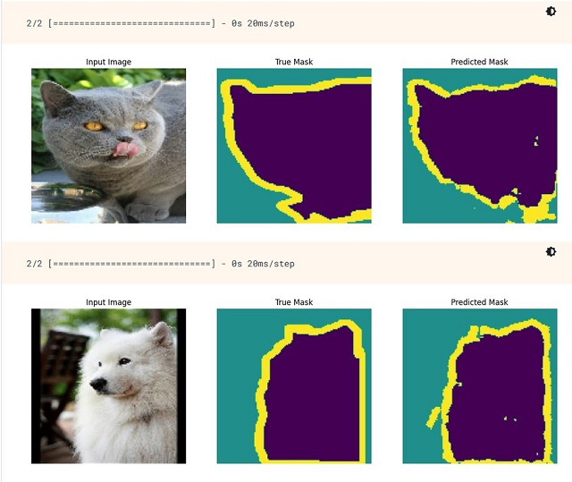 
Tensorflow.org has very nice <a href="https://www.tensorflow.org/tutorials/images/segmentation">tutorials to go through and even execute online.</a> One of them is about <a href="https://www.tensorflow.org/tutorials/images/segmentation">Image Segmentation</a> and the example is using a cats and dogs dataset. The model is trained on a mask to separate background from animal.
  
 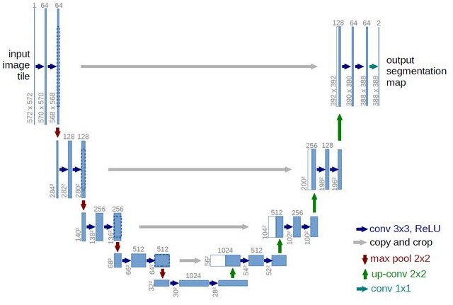 
The <a href="https://lmb.informatik.uni-freiburg.de/people/ronneber/u-net/">U-Net</a> architecture contains a downsample path followed by an upsample path, abstracting features and resulting in a classification map. 
  
 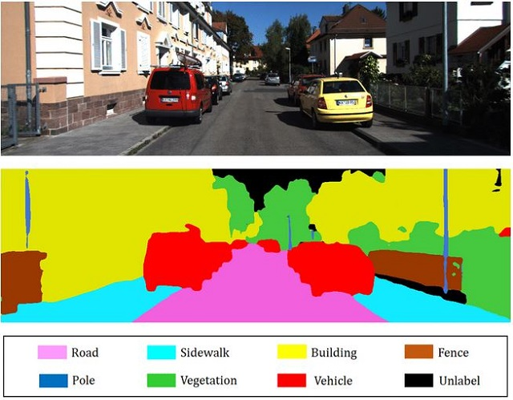 
There are a lot of examples online. This one from the <a href="https://towardsai.net/p/l/machine-learning-7">TowardsAI Website</a> looks like something for this project.
  
 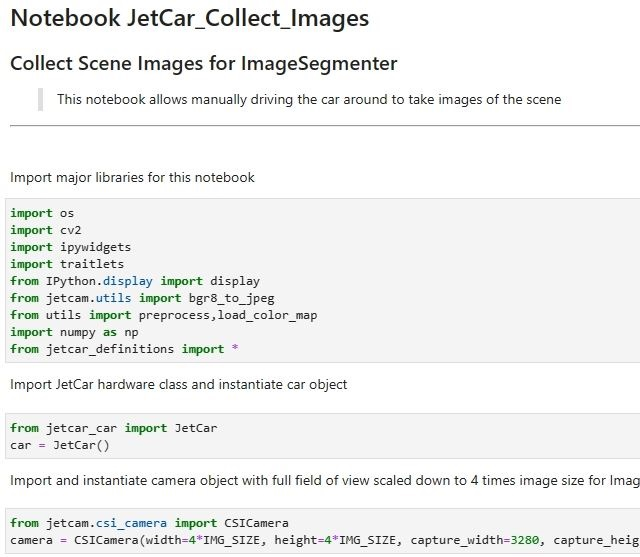 
The <a href="https://github.com/NVIDIA-AI-IOT/jetbot">JetBot</a> project contained a Jupyter notebook to capture images of the scene for its own training (data_collection.ipynb). A similar version is part of the firmware notebooks for the JetCar (<a href="https://github.com/StefansAI/JetCar/tree/main/firmware/jetcar/notebooks/JetCar_Collect_Images.ipynb">JetCar_Collect_Images.ipynb</a>). It allows manually driving the car around remotely and to hit a button to capture scene images. When done, the recorded images can be zipped and downloaded to the PC. 
JetBot and JetCar use image sizes of 224x224 for the inference. For better data augmentation however, the recorded images are here 4 times as big in both dimensions. 
  
 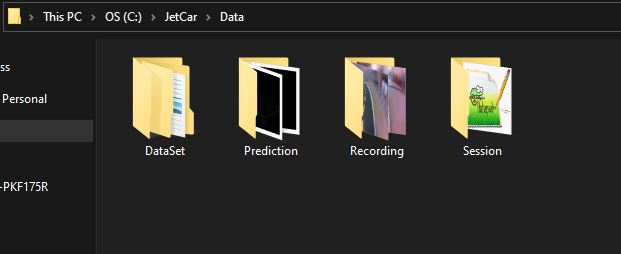 
Now a tool was needed to create masks for each image. This tool happens to be now part of this repository as <a href="https://github.com/StefansAI/JetCar/tree/main/tools/bin/ImageSegmenter">compiled executable </a>and as <a href="https://github.com/StefansAI/JetCar/tree/main/tools/source/ImageSegmenter">full source code project.</a> 
The Data folder for the ImageSegementer has to have a subfolder called "Recording", where all captured images need to go. 
  
 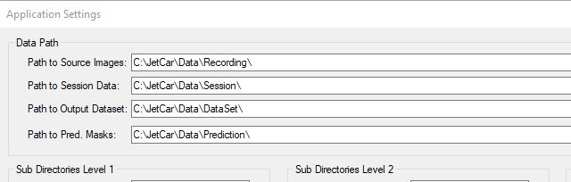 
The very first time, this application is executed, it might prompt you to check and possibly correct the data path entries in the Settings dialog. A configuration file will be created to reload the last settings at startup.
  
 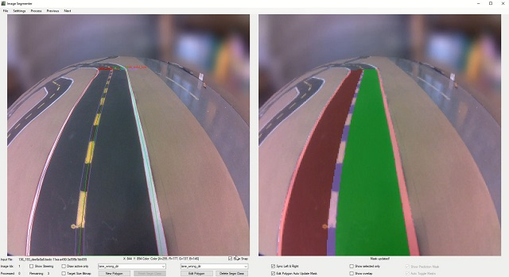 
The basic idea of this application is going through the recorded images one by one and creating the mask for each. The full resolution image is shown on the left side and the downsampled version as background on the right.
  
 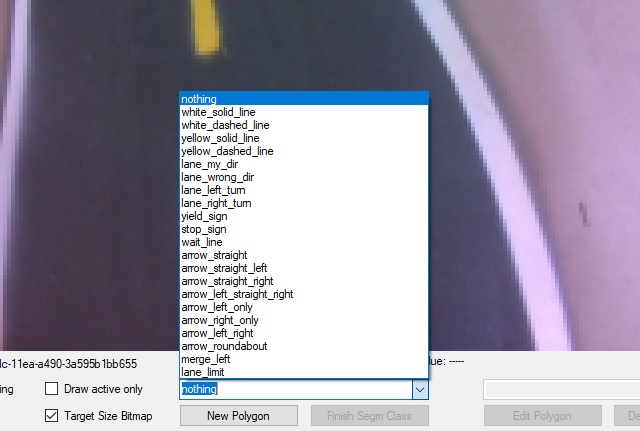 
Every area to represent any specific class will have to be outlined with a polygon. To start outlining, select an object class from the combo box and hit "New Polygon".  Outline the area with the mouse and left click everywhere, where a polygon point needs to be added. When close to an edge, the point will be automatically snapped to the edge, but this function can be disabled with a check box.  A left double click closes the polygon and ends the mouse entry. Hit the "Finish Segm Class" button to finalize it. The polygon changes to the class color and the enclosed area appears in the same color transparent on top of the scene background on the right side.
  
 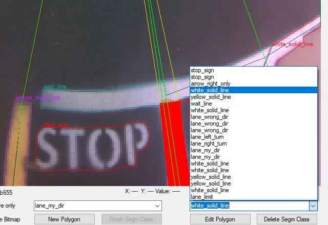 
Every class polygon already entered will show up in the edit combobox. To identify the correct one out of several same classes, click on one and it will be highlighted as red filled polygon.
  
 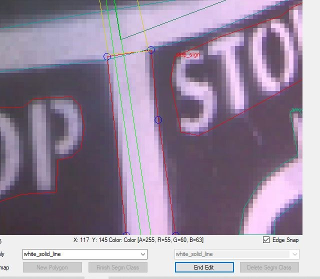 
Hit the "Edit Polygon" to make changes. The polygon points are marked as circles and can be grabbed with the left mouse button and moved around until the left mouse button is released.  Scroll the mouse wheel to zoom in or out from the current position.  To add a point, left click on the polygon line and the drag newly created point in position.  To delete a point, just right click on it. 
The class selection box to the left shows the same class, but is accessible to change the assignment. 
Hit the "End Edit" Button to finalize the changes made.
  
 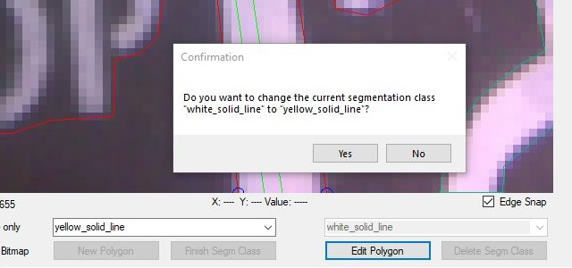 
In case, the class change was not intended, a confirmation dialog comes up. "No" will go back to edit mode. 
  
 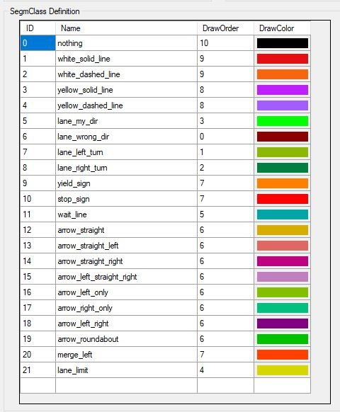 
The list of class definitions can be freely changed in the settings dialog and this application can be used for completely different types of segmentation tasks.
The ID is the code to represent this class in the mask, the name can be anything and the draw order controls handling of polygon overlaps. When a mask is generated, the application starts with all objects with DrawOrder=0, then 1 etc. This guarantees that for instance the lanes will be drawn in an order on top of eachother, then arrows and texts and lines at last. Knowing the draw order helps outlining with overlap.
  
 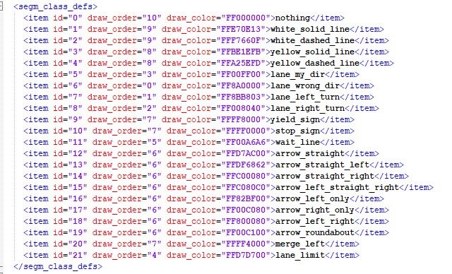 
Together with all other settings, the class definitions are stored in the settings XML file and can be also overwritten there with a text editor when necessary. 
Attention: Keep the file structure intact or things will go south!
  
 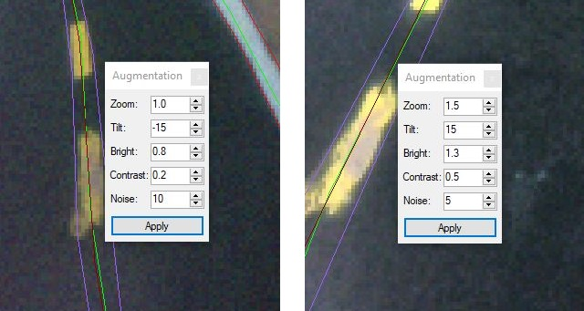 
Under the "Process" menu, the Augmentation panel can be opened. It allows testing the available augmentation parameter on the current image. Read here for more info on <a href="https://www.tensorflow.org/tutorials/images/data_augmentation">Data Augmentation</a> 
The example image above demonstrates two different sets of these parameters on the same image detail. It is good to test some parameter before creating a dataset with parameters, that don't work well together.
  
 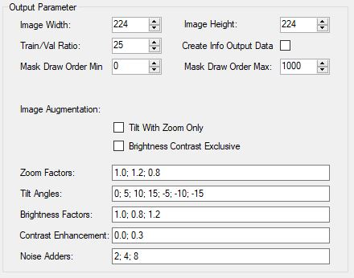 
In the Settings dialog, there is a list of augmentation parameter to go through when creating a dataset. The numbers have to be separated with ";". Any sequence of numbers can be entered.  
But keep in mind all variations multiply the number of dataset images. In the screen shot example, one recorded image will result in 3x7x3x2x3=378 image/mask sets. In other words, 100 original images end up as 37800 sets. Checking the 2 checkboxes reduces the multiplier by excluding some of the combinations. 
The "Train/Val Ratio" parameter above defines the ratio between the 2 output folders for training and validation. 25 for instance means, about every 25th set goes into the validation folder.
  
 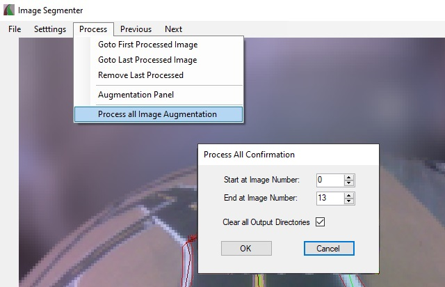 
After all recorded images have gone through the class outlining process, the dataset can be generated via the "Process" menu. After the confirmation, the dataset generation starts and can be observed while running for some longer time. 
In the end, all images and masks are in the DataSet folder sorted into subfolders for images and masks and their subfolders for training and validation. 
All mask files are stored into PNG files that appear black, since the class codes are counting from 0 up. 
The DataSet folder can be zipped up into JetCar_DataSet.zip for a model training run.
   

- <a href="Model%20Training.md">Model Training</a> 
- <a href="StreetMaker.md">Street Maker</a> 
- <a href="Operation.md">Operation</a> 
