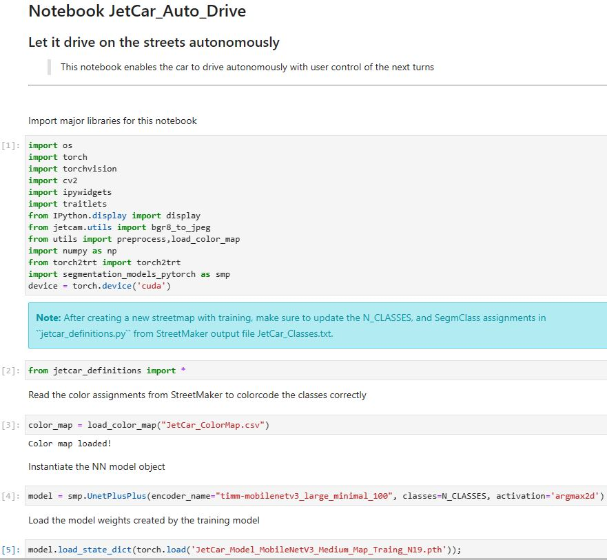

<h1 style="text-align: center;">JetCar</h1>
<h2 style="text-align: center;">Debugging</h2>
 

Debugging a real-time system is a special task. The GUI cannot give all the information needed to recognize an issue and it also might disappear very quickly. It is not possible to step through the code in real-time. Any printf-commands are very intrusive to the timing and real-time performance. 

 
The self-driving functionality is implemented in the notebook JetCar_Auto_Drive. This notebook instantiates a couple of classes and GUI elements for visualization and control.
It utilizes widgets, arranges them in a display layout and defines event handlers.
 
