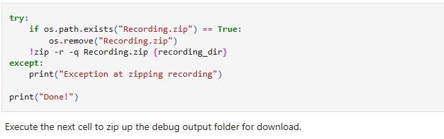
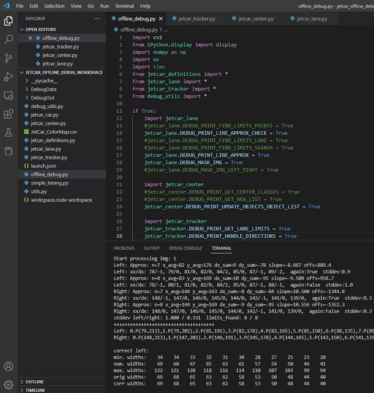

<h1 style="text-align: center;">JetCar</h1>
<h2 style="text-align: center;">Debugging</h2>
<br>
Debugging a real-time system is a special task. The GUI cannot give all the information needed to recognize an issue and it also might disappear very quickly. It is not possible to step through the code in real-time. The printf-commands can be very intrusive to the real-time performance and should be avoided.<br>
What works well for real-time embedded systems is logging. If possible, log binary information in RAM to be stored and processed later. But here it was best to simply store the camera frame and the mask from the inference to the SD card. The system normally buffers in RAM and writes to SD in the background.<br>
<br>
For this reason, the Jupyter notebook <a href="https://github.com/StefansAI/JetCar/blob/main/firmware/jetcar/notebooks/JetCar_Auto_Drive.ipynb">JetCar_Auto_Drive.jpynb</a> has this cell above. If there is any wrong behavior, set SAVE_IMG_AND_MASK to true:<br>

```
recording_dir = "DebugData/"
make_or_clear_directory(recording_dir)

SAVE_IMG_AND_MASK = True   # set to True for recording image and mask in real-time for offline debugging
```

This enables these lines in the execute function:<br>

```
 # If enabled, save image frame and mask 
    if SAVE_IMG_AND_MASK == True:
        save_img_and_mask(recording_dir, img_count, image, mask)
```
With this, repeat the same scenario and let it record images and masks in the recording_dir. Just record enough to include the issue and then stop.
<br>
Execute this cell after stopping and download the file "Recording.zip".<br>
<br>
Set up an environment with <a href="https://code.visualstudio.com/Download">Visual Code</a> for instance and copy the <a href="https://github.com/StefansAI/JetCar/tree/main/firmware/offline_debug">offline debug files</a> and all needed Python files from <a href="https://github.com/StefansAI/JetCar/tree/main/firmware/jetcar/notebooks">JetCar/notebooks/</a><br>:

- jetcar_definitions.py
- jetcar_tracker.py
- jetcar_center.py
- jetcar_lane.py

Open <a href="https://github.com/StefansAI/JetCar/blob/main/firmware/offline_debug/offline_debug.py">offline_debug.py</a>. At the top it defines the input and output directories and the range of image/mask pairs to be processed:<br>

```
RECORDING_MIN = 0 
RECORDING_MAX = 1000
RECORDING_DIR = "DebugData/"
MASK_OUTPUT_DIR = "DebugOut/"
```

In the python files from the JetCar all debug outputs are disabled for faster runtime. But here you can selectively enable anything of interest by just commenting or uncommenting any line:<br>

```Python
if True:
    import jetcar_lane
    #jetcar_lane.DEBUG_PRINT_FIND_LIMITS_POINTS = True
    jetcar_lane.DEBUG_PRINT_LINE_APPROX_CHECK = True
    #jetcar_lane.DEBUG_PRINT_FIND_LIMITS_LANE = True
    #jetcar_lane.DEBUG_PRINT_FIND_LIMITS_SEARCH = True
    jetcar_lane.DEBUG_PRINT_LINE_APPROX = True
    jetcar_lane.DEBUG_MASK_IMG = True
    #jetcar_lane.DEBUG_MASK_IMG_LEFT_RIGHT = True

    import jetcar_center
    #jetcar_center.DEBUG_PRINT_GET_CENTER_CLASSES = True
    #jetcar_center.DEBUG_PRINT_GET_NEW_LIST = True
    jetcar_center.DEBUG_PRINT_UPDATE_OBJECTS_OBJECT_LIST = True

    import jetcar_tracker
    jetcar_tracker.DEBUG_PRINT_GET_LANE_LIMITS = True
    jetcar_tracker.DEBUG_PRINT_HANDLE_DIRECTIONS = True
    jetcar_tracker.DEBUG_PRINT_PROCESS_CLASSES = True
```
The main loop can be boiled down to just reading the files and process the mask and direction<br>:

```Python
for img_count in range(RECORDING_MIN,RECORDING_MAX):
    print("Start processing %s" %("Img: %d" %(img_count)))
    filename = 'Img_%03d.jpg' % (img_count)
    image_path = os.path.join(RECORDING_DIR, filename)
    
    if os.path.exists(image_path):
        image = cv2.imread(image_path)
     
        filename = 'Mask_%03d.npy' % (img_count)
        mask_path = os.path.join(RECORDING_DIR, filename)
        mask = np.load(mask_path,mmap_mode='r') 
        #...
        if img_count > 0:
            tracker.process(mask, next_direction)
        
        print("Img: %d ->processed!" %(img_count))
  
    else:
        break

```

Constants in Python are actually variables and can be changed at runtime and here it can be used as a benefit. You can change the direction at a specific frame number or turn on more logging at another frame number to dig into the code.<br>

```Python
        if img_count == 0:
            next_direction = Direction.Straight
        if img_count == 10:
            next_direction = Direction.Right
        #if img_count == 40:
        #    next_direction = Direction.Left
        elif img_count == 22:
            jetcar_tracker.DEBUG_PRINT_GET_LANE_LIMITS = True
            jetcar_lane.DEBUG_MASK_IMG_LEFT_RIGHT = True
            jetcar_lane.DEBUG_PRINT_LINE_APPROX_CHECK = True
            jetcar_lane.DEBUG_PRINT_FIND_LIMITS_LANE = True
            jetcar_lane.DEBUG_PRINT_FIND_LIMITS_POINTS = True
            jetcar_center.DEBUG_PRINT_GET_CENTER_CLASSES = True
        elif img_count == 23:
            break

```

Besides utilizing all the possible logging capabilities, you can now also step through the code. And you can break at a specific frame and then step through.<br><br>

<br>
The output directory now contains readably mask images with overlaid information and more outputs for frame 22.<br><br>
The Terminal window contains all the logging output for each frame. It could look like this for instance:<br>

```
Start processing Img: 21
Left: Approx: n=7 x_avg=84 y_avg=176 dx_sum=4 dy_sum=-78 slope=-19.500 offs=1822.6
Left: xx/dx: 83/1, 83/1, 84/2, 84/-6, 85/0, 86/2, 87/1, 87/-4,  again:True  stddev:2.4
Left: Approx: n=8 x_avg=85 y_avg=169 dx_sum=5 dy_sum=-95 slope=-19.000 offs=1779.2
Left: xx/dx: 82/0, 83/1, 84/2, 84/-6, 85/0, 86/2, 87/1, 87/0,  again:False  stddev:2.4
Right: Approx: n=7 x_avg=163 y_avg=176 dx_sum=25 dy_sum=-78 slope=-3.120 offs=685.7
Right: xx/dx: 152/0, 155/1, 159/2, 163/2, 167/0, 172/-3, 177/0, 182/1,  again:True  stddev:1.5
Right: Approx: n=8 x_avg=166 y_avg=169 dx_sum=30 dy_sum=-95 slope=-3.167 offs=693.5
Right: xx/dx: 152/0, 155/1, 159/2, 163/2, 167/0, 172/-3, 176/-1, 182/0,  again:False  stddev:1.5
stddev left/right: 2.398 / 1.536  limits_found: 8 / 8
+++++++++++++++++++++++++++++++++++++
Left: 0.P(82,213),1.P(82,202),2.P(82,191),3.P(90,178),4.P(85,165),5.P(84,150),6.P(86,135),7.P(87,118),8.P(88,101),9.P(89,82),10.P(90,63),
Right: 0.P(152,213),1.P(154,202),2.P(157,191),3.P(161,178),4.P(167,165),5.P(175,150),6.P(177,135),7.P(182,118),8.P(187,101),9.P(193,82),10.P(199,63),

min. widths:    35    34    33    34    32    30    28    26    24    22    20
nom. widths:    70    69    67    68    64    61    57    53    49    45    40
max. widths:   123   122   120   121   117   114   110   106   102    98    93
orig widths:    70    72    75    71    82    91    91    95    99   104   109
corr widths:    70    72    75    71    82    91    91    95    99   104   109

Left: 0.P(82,213),1.P(82,202),2.P(82,191),3.P(90,178),4.P(85,165),5.P(84,150),6.P(86,135),7.P(87,118),8.P(88,101),9.P(89,82),10.P(90,63),
Right: 0.P(152,213),1.P(154,202),2.P(157,191),3.P(161,178),4.P(167,165),5.P(175,150),6.P(177,135),7.P(182,118),8.P(187,101),9.P(193,82),10.P(199,63),
+++++++++++++++++++++++++++++++++++++
get_lane_limits done: left=-19.0 right==-3.2 slope_avg=-11.1
Left objects: -31:143:lane_wrong_dir:20:3  124:10:yellow_dashed_line:0:3  134:19:lane_left_turn:1:3  135:9:yellow_dashed_line:6:1  144:10:lane_left_turn:8:1  153:9:nothing:1:3  154:9:white_shoulder_line:2:1  164:4:nothing:4:1
Center objects: 47:7:lane_right_turn:0:3  53:6:yield_line:10:3  124:10:yellow_dashed_line:8:3  152:9:white_shoulder_line:1:2  153:9:nothing:3:3
Right objects: -83:162:nothing:20:3  81:13:white_shoulder_line:5:3  90:26:lane_right_turn:6:3  116:8:yellow_dashed_line:5:3  125:10:lane_wrong_dir:5:3  135:28:nothing:1:3  151:9:nothing:5:1
process_classes direction:Straight  next_turn_direction:Right  stop_count=0
i:1 code: 8=yield_line in INTERSECTION_OBJECT_CODES
update_throttle  brake_light_enable=True, throttle_new_value=0.750, throttle_value=0.781
process_classes done, intersection=True, allowed:left=True, straight=True, right=True slope_avg=-11.1
current direction(Straight) != next_turn_direction(Right)
steering value:0.209  dir:Straight
Img: 21 ->processed!
```


