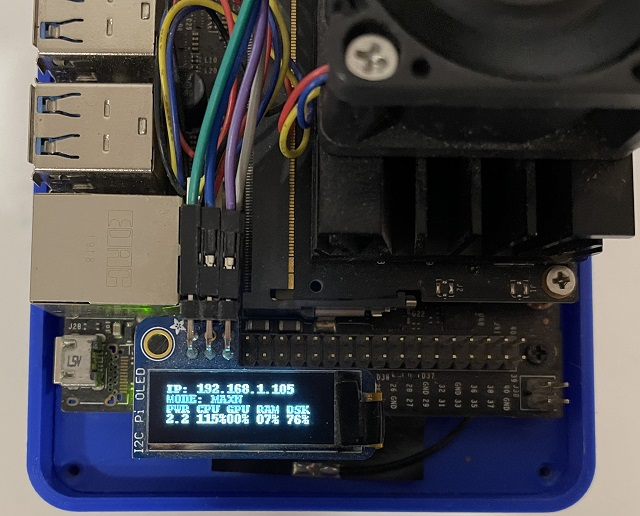

<h1 style="text-align: center;">JetCar</h1>
<h2 style="text-align: center;">Firmware Setup</h2>
 

  
JetCar runs on the <a href="https://developer.nvidia.com/embedded/jetpack">Jetpack</a> image provided by NVIDIA. Several different versions are available for download and there is a lot of other information to find.
  
  
The versions have progressed since the start of this project, which was based on 4.4.1. So far the scripts and the code itself has not been tested on a newer version, so it's best to stick with it for now. That SD card image is still available for download in the <a href="https://developer.nvidia.com/embedded/jetpack-sdk-441-archive">archive section.</a> 
 
  
The preparation is exactly the same as described on this <a href="https://jetbot.org/master/software_setup/sd_card.html">JetBot page</a>, just use the jetpack image instead. Flash the image with the <a href="https://www.balena.io/etcher">Balena Etcher</a>, plug the card into the Jetson Nano, connect monitor, mouse and keyboard and boot the system.
 
  
After initial startup, go through the standard setup dialogs. As in the JetBot setup, the user and password can be simplified to just jetson for everything if JetCar will operate inside a sandbox network.
 
  
For all startup initialization the Jetson Nano has to have a wired or wireless internet connection, which can be later replaced by a separate Wi-Fi.
 
  
Open the browser and open github.com/StefansAI/JetCar/firmware and click on the file jp441_install_all.sh. Once open, click on the RAW button in the upper right.
 
  
Then go up the File menu and hit "Save page as.."
 
  
The dialog changed the extension to .txt, make sure to rename it back to .sh and save in the Home directory.
 
  
Open the terminal and type: 
chmod +x p441_install_all.sh 
./jp441_install_all.sh [root_password] 
The script will now for about an hour to install everything needed.
 
  
After the installation, the PiOLED display should show an IP address. Open a browser on the PC and type that address in plus port number 8888. For instance in this case it would be 192.168.1.105:8888.
 
  
The log in for Jupyter will be the same as the user log in on the Jetson Nano. 
 
  
Jupyter comes up in the home directory. Navigate to JetCar/notebooks.  
 
  
It is easier to clone the firmware subfolder to your local PC and then simply select all files in the File Explorer to drag them over to the web browser with Jupyter open at JetCar/notebooks.
  
Have a look at the different files in this folder. There are 3 Jupyter notebooks and several Python files. There is still one more step to do before cutting off from the internet. Open the notebook "JetCar_Auto_Drive" and run the first 4 code lines, so the correct model file is downloaded from the web.  
It will be best to use separate (maybe older) Wi-Fi router only connected to the PC to connect the JetCar to. This way, the JetCar will not have to share all the Wi-Fi traffic of the family watching Netflix, Youtube or Prime.
  
Since from now on, all communications with the JetCar can go through Jupyter, the graphic user interface can be removed to save resources:
<a href="https://lunar.computer/posts/nvidia-jetson-nano-headless/">Jetson Nano Headless</a> 
 
In the end it might be also good to apply "sudo apt-get autoremove" and "sudo apt-get clean" from the Jupyter terminal for instance.
