<h1 style="text-align: center;">JetCar</h1>
<h2 style="text-align: center;">Data Preparation with ImageSegmenter</h2>
 

 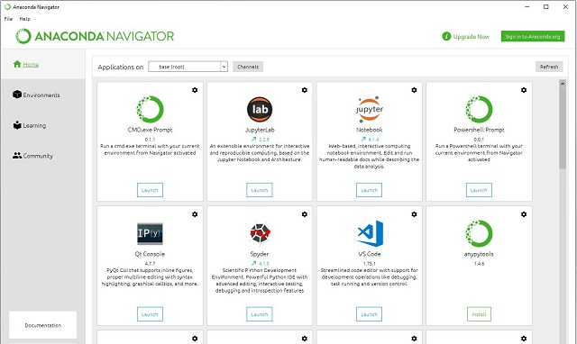 
The training can be performed on the PC after installing <a href="https://docs.anaconda.com/anaconda/install/windows/">Anaconda</a> and then Jupyter notebook and many other tools and libraries. But training with thousands of images can easily take days and turn the PC into a heater. So, moving into the cloud removes the stress from the local machine.
 
 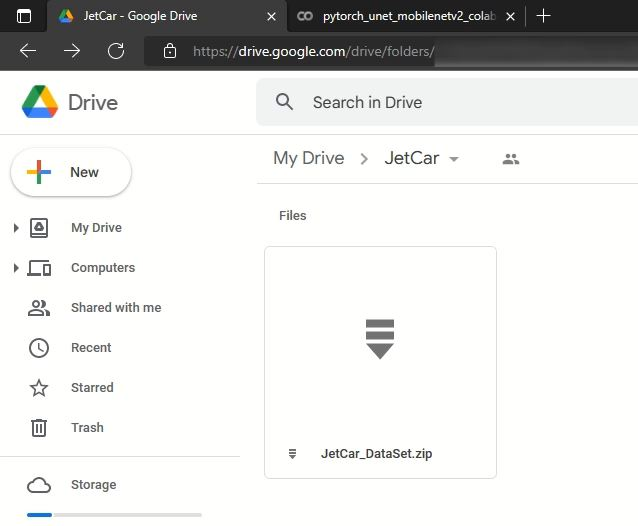 
The first step is getting a Google drive account and copy the dataset zip file there.
 
 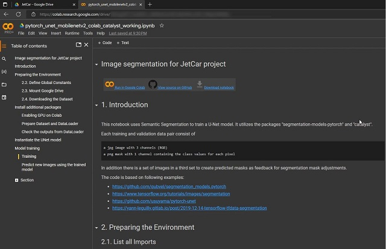 
Then open the <a href="https://github.com/StefansAI/JetCar/tools/jetcar_pytorch_unet_mobilenetv2_catalyst.ipynb">training notebook</a> in . For faster execution and stable connections upgrade to Colab Pro or Colab Pro+ to purchase units. Make sure to change runtime type to GPU and High-RAM.
 
 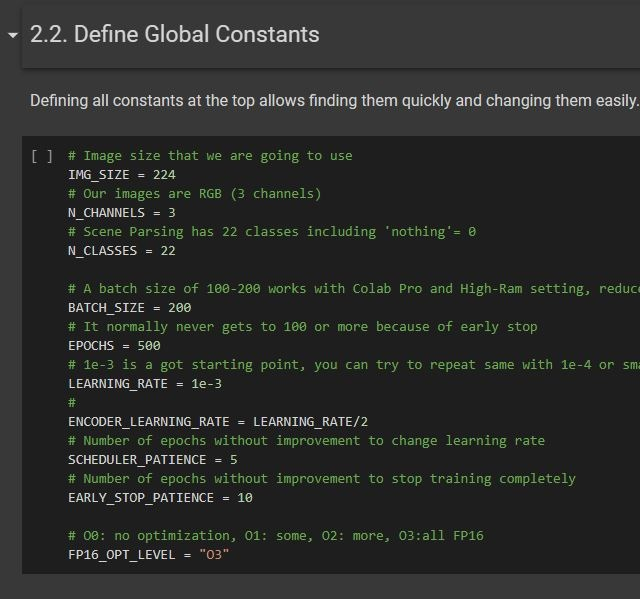 
The notebook starts with defining a couple of constants. The ImageSegmenter defined 22 classes, so N_CLASSES should be 22. 
The batch size will have to be reduced drastically on a PC and maybe on the standard Colab version. 
Everything else can be left as is. However, when a training run is stopped because of disconnection or any other cause, it can be restarted with the last learning rate of the of the disconnected run before. The notebook will pick up the last saved model weights file from the Google drive.
 
 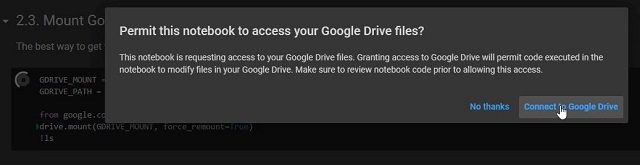 
Now hit "Run all" from the "Runtime" menu. After a moment, the notebook tries to connect to the Google drive and asks for permission.
 
 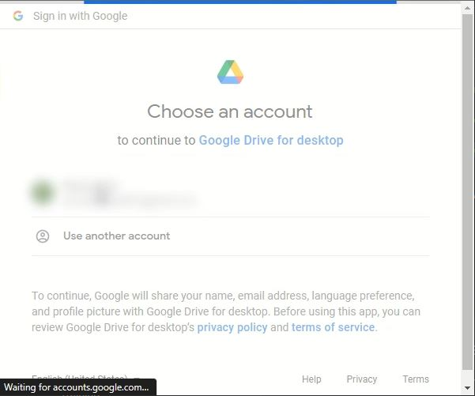 
If the Google drive is open in the same browser, the dialog will offer to connect to it. Click on the account (here blurred).
 
 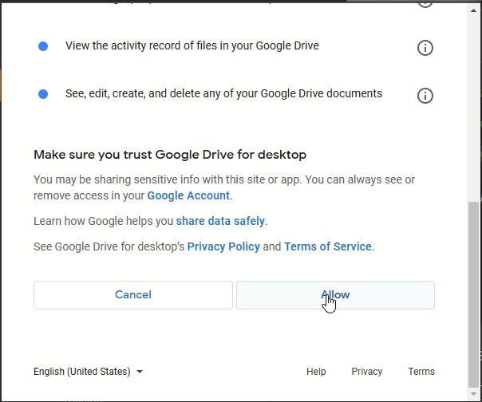 
Then scroll down and hit allow.
 
 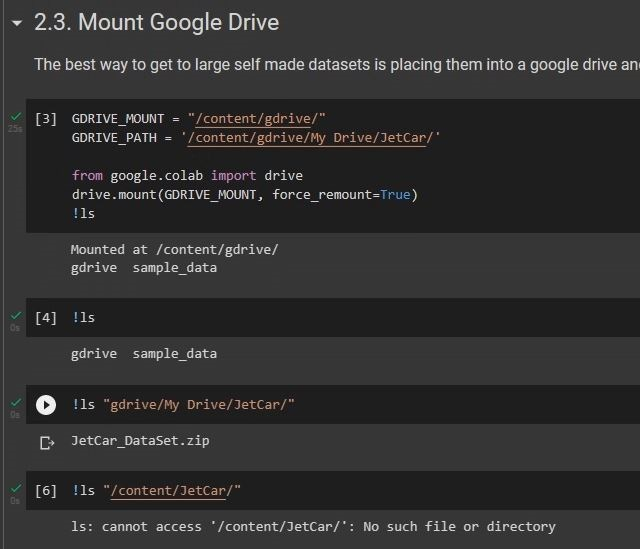 
The google drive will be mounted to the Colab machine, ready to download data. 
The ls commands show the contents of the Google drive and the cloud machine. The JetCar folder does not exist yet on the Colab machine.
 
 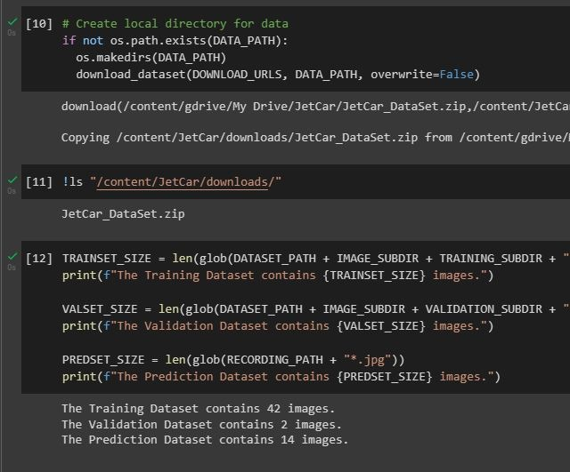 
Downloading the dataset file and unzipping takes a while, depending on the size. When done, the notebook lists the number of images for training, validation and prediction.
 
 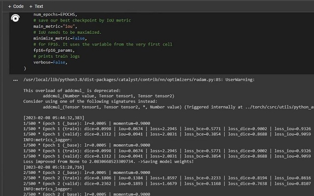 
The notebook will install a number of additional libraries, including Catalyst. 
Scrolling down to the cell, where the training is running, log entries will start showing up for each epoch. Each runs a few minutes. After the SCHEDULER_PATIENCE number of epochs without improvement, the learning rate will decrease. 
Whenever the message comes up, that it saves the model weights, the file is copied to the Google drive, so the progress is not lost at a disconnection.
 
 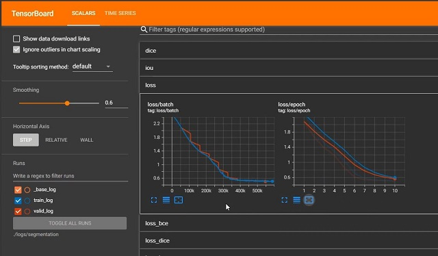 
After few epochs, the TensorBoard some cells above will start showing the results in different graphs after setting to scalars and reload.
 
 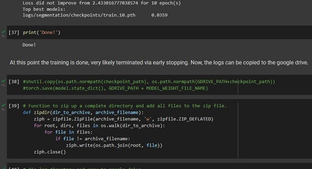 
When the training is done after no improvements, the notebook continues.
 
 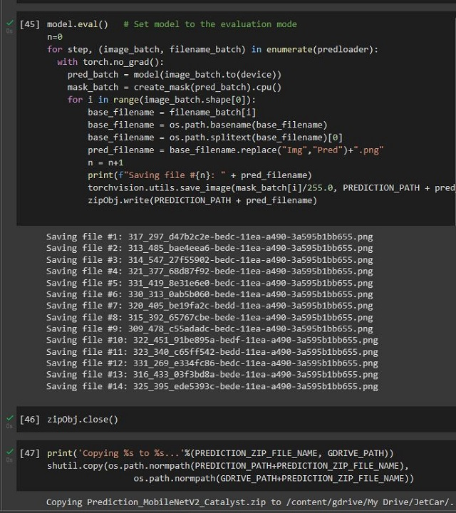 
All prediction test images are now run through model inference to create the prediction masks, which are then zipped up and stored in the Google drive.
 
 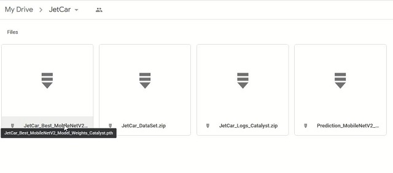 
The training will finish when despite reducing the learning rate no further improvement was achieved for EARLY_STOP_PATIENCE number of epochs. The notebook will then continue with the next cells and run the prediction. The prediction results are copied over to the Google drive and are now available for download to the local PC.
 
 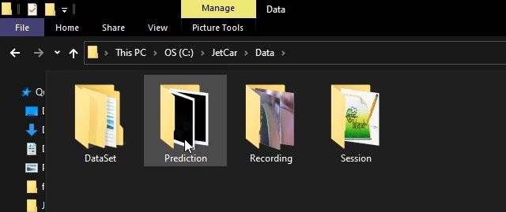 
Extract the prediction masks into the prediction subfolder of the ImageSegmenter Data path.
 
 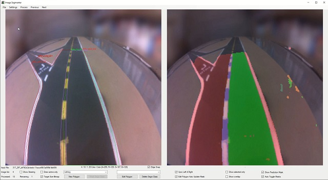 
When starting the ImageSegmenter application now, it will toggle the prediction mask on the right side with the true mask for each image. Here is the prediction mask and below the true mask.
 
  
True mask to compare with predicted mask above.
  

- [Data Preparation with ImageSegmenter](Data%20Preparation.md)
- [Street Maker](StreetMaker.md)
- [Operation](Operation.md)

