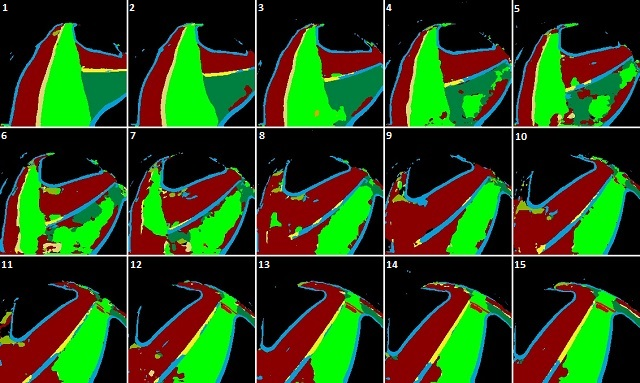

<h1 style="text-align: center;">JetCar</h1>
<h2 style="text-align: center;">Operation</h2>
 
 
The self-driving functionality is implemented in the notebook JetCar_Auto_Drive. This notebook instantiates a couple of classes and GUI elements for visualization and control.
It utilizes widgets, arranges them in a display layout and defines event handlers.
 
 
But in the ned it all comes down to this execute handler, which is called for each new frame from the camera. Right at the beginning after getting the camera image this function exits immediately, if the last cycle ran over its time limit. For real-time processing it is better to skip a data sample than starting to buffer and increasing the reaction time. 
When continuing, the mask is generated via model inference and then it is processed by the tracker object.
 
 
This graph shows the data flow. The LaneTracker class in the file "jetcar_tracker.py" now passes the mask on to its LaneLimits ("jetcar_lane.py") instances and after some preparations to LaneCenter ("jetcar_center.py") instances. In the end, the LaneTracker class calculates new steering and throttle values and signals, which are then passed on to the JetCar class instance by the notebook to control the servo, the motors and the LEDs.
 
 
Let's go through it in detail. On the left is a frame as it comes from the camera. It is very different from the artificial camera view generated by the StreetMaker. The paper with the printout isn't lying flat and shows some waves distorting the lines. And there are reflections from the ceiling lights and a lot of noise. On the right the mask generated from the model inference. It is surprising, that it comes out pretty clean despite the imperfect input.  Just one the side: This example came from a debug run, where the model did not recognize the right turn arrow. That was fixed by collecting real images of arrows, run them through the ImageSegmenter and add them to the artificial dataset for the next training run.
 
 
The LaneTracker class first calls its get_lane_limits() method, which then calls find_limits() for lane_limits_left and lane_limits_right instances of the LaneLimit class. The find_limits() method searches in the mask for the lane limits left or right depending on the side. Each LaneLimit class owns its array of LaneLimitPoint instances. Their final locations after the search is shown above for the left and right objects. 
The search can take longer initially for the first frame. But after that the changes between frames are relatively small and the search is faster. 
 
 
The LaneLimit class then approximates a line through the found limit points and extrapolates additional point further out.  An originally implemented linear regression algorithm was occasionally too much effected by outliers to result in almost horizontal lines that it had to be replaced with the current algorithm averaging the slopes between the points.
 
 
Masks are not always as clean as this one and some outliers can be far out impacting the line approximation, which is used for the steering calculation later. So, the distance of each search point from the line is checked and outliers are adjusted in a second round. Here only one point on the right side above the yield line has been adjusted.
 
 
Back at the LaneTracker class, additional checks try to clean up more if the points are outside the expected lane width. It uses the standard deviations between points and line for each side to decide, if one side is too noisy to be trusted and might need correction.  
The masks above are very clean and there was no need. But it can happen, that there are false classifications or many artefacts in the mask. The whole processing has to be stable enough to figure out the most probable direction. 
The left side above now shows the final result of the left and right limits plus added points for the center of the driving lane and possible centers of the lanes left and right. The point arrays are passed to LaneCenter instances for left, center and right. More points are interpolated in between as seen on the right side. To avoid relying on single point decisions, the dominant class codes around each point is determined. The dominant class is the one code in the pixel neighborhood, that appears most. This gives now a very good sampling interval in each lane center. 
The next step in the LaneCenter class is run-length encoding of the classes in each direction for object tracking. Here are the RLE lists from this example:

|         Left objects          |         Center objects        |         Right objects         |
|-------------------------------|-------------------------------|-------------------------------|
|                               |                               | 160:0:nothing:0:3             |
|                               |                               | 151:9:white_shoulder_line:0:3 |
|                               |                               | 141:10:lane_wrong_dir:0:3     |
| 164:0:nothing:0:3             |                               | 132:9:yellow_dashed_line:0:3  |
| 155:9:lane_left_turn:0:3      | 160:0:nothing:0:3             | 114:18:lane_right_turn:0:3    |
| 145:10:yellow_dashed_line:0:3 | 141:10:yellow_dashed_line:0:3 | 105:9:white_shoulder_line:0:3 |
| 0:145:lane_wrong_dir:0:3      | 88:9:yield_line:0:3           | 0:105:nothing:0:3             |
 

Let's look at the left list. It is sorted from close to the car at the bottom to far out at the top. It starts with 0:145:lane_wrong_dir, which means there is a class code for wrong direction starting at distance=0 with a length of 145. In an image of 224x224 this object stretches into the top half and that is exactly what we can see. Then there is a yellow dashed line, followed by a left turn lane and then nothing. 
In the center lane, the driving direction code is dropped, because it is assumed to be there. So, the list starts with the yield line, then the yellow dashed line again and nothing at the end. 
On the right side there is nothing at the beginning for a long stretch, but then a lot of different class codes.
 
Now let's look at the tracking part:

|         Left objects          |         Center objects        |         Right objects         |
|-------------------------------|-------------------------------|-------------------------------|
|                               |                               | 160:0:nothing:2:3             |
|                               |                               | 151:9:white_shoulder_line:1:3 |
| 165:1:nothing:1:3             |                               | 141:10:lane_wrong_dir:2:3     |
| 165:0:white_shoulder_line:2:1 |                               | 132:9:yellow_dashed_line:2:3  |
| 156:9:lane_left_turn:5:3      | 160:0:white_shoulder_line:1:2 | 114:18:lane_right_turn:3:3    |
| 146:10:yellow_dashed_line:3:3 | 141:10:yellow_dashed_line:5:3 | 105:9:white_shoulder_line:2:3 |
| -38:144:lane_wrong_dir:17:3   | 88:9:yield_line:7:3           | -58:163:nothing:17:3          |
 

The new RLE lists are now merged with the tracking lists. The algorithm tries to match new list and tracking list items. When a match is found, the starting point and the length (or size) are updated. There are more items in the lists than in the new lists, which means that there are objects sampled before. As stated above, the 2 numbers in front of the class code name are distance:length. The 2 numbers after are alive:ttl. The alive-number is increased with each cycle this object is tracked in the list. The ttl-number (Time-To-Live) is decremented each time this object does not appear in a new list. When reached 0, this object entry will be removed from the list. This ensures, that any artefacts are cleaned up. In the example above, the white shoulder line entry might disappear in the next cycle, if it is not detected again. In this case, the detection was correct, but just too far out and too small at this point. When it comes closer, it might be re-introduced again. 
If the alive-number is low, the probability of this entry beeing a false detection is still high. A high number on the other side clearly states that this is very real. The LaneTracker class, can now make decisions with these entries. It can check distance, size (length) and alive count to react on it. For instance a right turn should wait until the right turn lane is close enough, more than a few pixel wide and tracked for some time to start the turn. In this example, those conditions are not met yet. 
One more comment about the negative distances in the lists above. The distance of 0 starts at the number and increases from there out to the front. A negative value would indicate something under the car or behind. The camera would not be able to see it, so why is it kept in the list? 
When approaching an intersection, there might be a left turn only arrow or a stop text. But getting closer to entering the intersection or at the stop line, it is already out of sight. Those objects will have to be kept in the lists to make the correct turn or to make a stop correctly. After the turn or passing the intersection, those entries need to be cleaned up via special calls. 
The cleanup also sets the flags that all directions are allowed for the next intersection to come. Whenever an arrow appears, these flags are updated accordingly. So, when the next left or right turn code comes up and a direction was requested, these flags are checked before a turn can be initiated. 
It can be imagined, that there are a lot of conditions to be checked while driving. The process() method of the LaneTracker class contains a lot of if-statements to make it work. And there are many defined thresholds, that worked for tested conditions. But real-world/real-time conditions might still cause the car making wrong decisions. Fortunately, nobody will be run over by a toy car and you can play around with the code to find better solutions.  
Implementing a stop is relatively easy. Just keep the throttle at 0 for a bit and it looks like a stop. No traffic is expected at this point :-). So, a stop counter will do just fine. 
Turning is a different problem. The lane ahead is our driving lane and the turn lane might be coded left turn or right turn lane. What happens while turning? The answer is: Chaos. 
 
Above is a sequence of masks recorded in a right turn. As can be seen, in a turn the classification of pixels has to change from right turn (olive green) to my driving direction (green), but the transition creates a lot of artefacts and even wrong classifications. To overcome this, the steering is set to a turn and the masks are simply not processed for a few frames. It can be compared to our driving, when we start turning the wheel to some estimated turn radius and hold it until we can straighten it out again. Of course, we constantly check, if we need to correct. So, the JetCar will do something similar. It will initiate a turn, setting the steering to a fixed value. It will then ignore the masks for few cycles and then start tracking again. In the sequence above for instance it can ignore the masks from frame 1 to 7 after the turn, but frame 8 might give results good enough in the diagonal to start tracking again. It can keep turning, but start correcting the steering to get the car aligned. 
In the implementation the LaneTracker class owns a steering_fixed_count, which is set to a positive value when the turn is initiated. The steering value is not changed and anything is ignored for a few frames. But with each new frame it will be decremented and about half way through to 0, the limit search is enabled again and steering values are calculated. If it is getting closer to alignment in about +/-45 degree in front, the counter is set to 0 and operation resumes normally. Otherwise the fixed turn continues until it reached 0 and the steering resumes from there.  

- [Data Preparation with ImageSegmenter](Data%20Preparation.md)
- [Model Training](Model%20Training.md)
- [Street Maker](StreetMaker.md)
