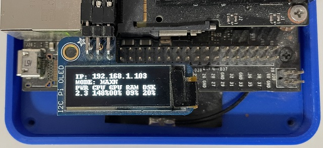

<h1 style="text-align: center;">JetCar</h1>
<h2 style="text-align: center;">SD Card Setup</h2>
<br><br>
<br><br>
JetCar runs on the <a href="https://developer.nvidia.com/embedded/jetpack">Jetpack</a> image provided by NVIDIA. Several different versions are available for download and there is a lot of other information to find.
<br><br>
<br><br>
The last version with Jetson Nano support can be found under JetPack 4.6.3 in the archive section. But when opening the page, the version for download is actually <a href="https://developer.nvidia.com/jetpack-sdk-463">4.6.1</a>. Open the link and hit the download button.
<br><br>
<br><br>
The preparation is exactly the same as described on this <a href="https://jetbot.org/master/software_setup/sd_card.html">JetBot page</a>, just use the jetpack image instead. Flash the image with the <a href="https://www.balena.io/etcher">Balena Etcher</a>, plug the card into the Jetson Nano, connect monitor, mouse and keyboard and boot the system.
<br><br>
<br><br>
After initial startup, go through the standard setup dialogs. As in the JetBot setup, the user and password can be simplified to just jetson for everything if JetCar operates later inside a sandbox network.
<br><br>
<br><br>
For all startup initialization the Jetson Nano has to have a wired or wireless internet connection, which can be later replaced by a separate Wi-Fi.
<br><br>
<br><br>
Open the browser and open github.com/StefansAI/JetCar/firmware and click on the file <a href="https://github.com/StefansAI/JetCar/blob/main/firmware/install.sh">"install.sh"</a>. Once open, click on the RAW button in the upper right.
<br><br>
<br><br>
Then go up the File menu and hit "Save page as.."
<br><br>
<br><br>
The dialog changed the extension to .txt, make sure to rename it back to .sh and save in the Home directory. Hit the save button in the lower right.
<br><br>
<br><br>
Open the terminal and type:<br>

```
chmod +x install.sh
./install.sh [root_password]
```

The script will run now for about an hour to install everything needed.
<br>
At this point, the JetCar can be cut off from the internet by switching Wi-Fi settings to a sandbox Wi-Fi. It will be best to use a separate Wi-Fi router only connected to the PC to connect the JetCar to. This way, the JetCar will not have to share all the Wi-Fi traffic of the family watching Netflix, YouTube or Prime :-)
<br><br>
<br><br>
After the installation, the PiOLED display should show an IP address. Open a browser on the PC and type that address in plus port number 8888. For instance in this case it would be 192.168.1.103:8888.
<br><br>
<br><br>
The log-in for Jupyter will be the same as the user log in on the Jetson Nano. 
<br><br>
<br><br>
Jupyter comes up in the home directory. Navigate to JetCar/notebooks.  
<br><br>
<br><br>
It is easier to download the firmware subfolder to your local PC and then simply select all files in the File Explorer to drag them over to the web browser with Jupyter open at JetCar/notebooks/. 
<br><br>
<br><br>
Have a look at the different files in this folder. There are 3 Jupyter notebooks and several Python files. The first notebook needed, is the JetCar_Basic_Motion for testing the assembly.
<br><br>
Since from now on, all communications with the JetCar can go through Jupyter, the graphic user interface can be removed to save resources:
<a href="https://lunar.computer/posts/nvidia-jetson-nano-headless/">Jetson Nano Headless</a><br>
<br><br>
In the end it might be also good to apply "sudo apt-get autoremove" and "sudo apt-get clean" from the Jupyter terminal for instance.
<br><br><br>

- [BOM](BOM.md)
- [Assembly](Assembly.md)
- [Data Preparation with ImageSegmenter](Data%20Preparation.md)

