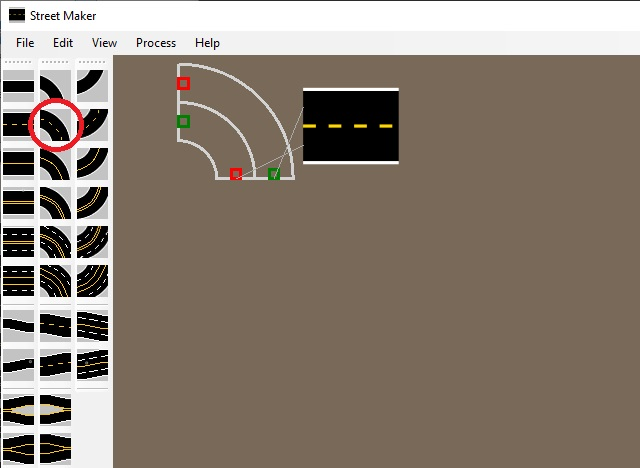
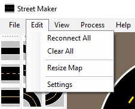
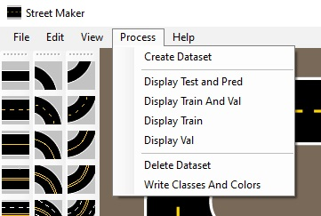

<h1 style="text-align: center;">JetCar</h1>
<h2 style="text-align: center;">StreetMaker</h2>
 

 
Making a street map with a lot of different templates, cut out of paper and hours of spray painting is a lot of work. It turned out to be too large to spread it out, when the garage had to be used by those big cars. :-( 
Something new was needed to create a street map in a much simpler way and could possibly do much more ...
 
  
This application is part of this repository. You can find the Windows executable and the full source code in the tools folder.  
In the middle of the screen is the map area. On the left side is a tool bar with different street segments and on the right with intersections and overlays.
 
  
To start creating a new map, simply click on one of the tool buttons and then move the mouse over to the map. The outline appears with red and green connector boxes indicating in and out of the lanes.
 
  
Click on the map to drop it there.
 
  
Grab a curve piece and when moving over, lines appear to show where it can click together.
 
  
When getting the possible connectors even closer together, the curved segment auto rotates and can be moved into position. It can be also manually rotated with the hotkeys "R" to the right and "E" to the left.
 
  
Left mouse click snaps them together and they are now connected.
 
  
To disconnect any street element, simply hover the mouse over the element and hit "D" for disconnect.
 
  
When hovering for instance over the lower left red connector, pressing "S" for sizing, left mouse clicking and dragging the connector, the curve gets more or less bend around. The angle changes but the radius stays the same. 
Pressing "A" instead of "S", left mouse click and drag will result in radius and angle getting changed.
 
  
Right clicking on any street element bring up its property page dialog as seen here for the curve piece. Change the "Inner Radius" to 200mm and the "Curve Angle" to 90 degrees for instance. 
There are many other parameter to change for each street element, like number of lanes in both directions and the limiting lines. In fact, each street can even be changed into any other street, except into intersections. But any intersection type can also be changed into any other intersection type. 
After the change the curve might be separated from the straight street. Each element has a starting point as reference and changes are made to that reference, which might cause it to shorten or lengthen on the other side.
 
  
Add a "Dual Lane with Exit" from the right side. It can also be seen as an off-ramp. Open the property page and change the "Length" to 540mm and the "Ramp Curve Angle" to 90 degrees.
 
  
Add a "Dual Lane with Junction Lane", that looks like an on-ramp and change its "Ramp Curve Angle" to 90 degrees. It looks perfect for adding a dual lane below. Why the length of 540mm above? The "Ramp Radius" was 300mm and the lane width 120mm, but the on-ramp adds another lane width, so 540 together.
 
  
Add a "T-Intersection" on the left and a "4-Way-Intersection" on the right and should look like this. There are different ways to connect the 2 intersections. 
 
  
The simple one is using a "Dual Lane S-shaped Right". Connect it the the left.
 
  
Use the hot key "A" when grabbing a connector on the right to drag it to the right intersection close enough to let them snap together. Using an S-shaped street can always be used to connect any offset elements easily.
 
  
The other method is following: Add straight streets close enough for instance.
 
  
Now open the property dialog of the T-Intersection. The entering streets are indexed and the numbering appears with the outline when hovering over the intersection. In this case, the length of "Street 0" can be adjusted to shift "Street 1" down closer to the desired connection. 
Set "Street 0" length to 200mm.
 
  
A message shows up informing about 2 connection issues. This will always come up, whenever connectors are close, but cannot be snapped together. When clicking on any item in the list, the location will be shown and what direction should be any corretion. Here it shows a dx=16.656mm and dy=0. The angle difference between the 2 connectors shows d_angle=-180, which is no problem and neither is dy. So, we only need to add 16.656mm to the intersection or to the straight street to close the gap. 
This can be done via the property dialogs of either one, or via sizing the street length via mouse and hotkey "S". The last method might require a disconnect via "D" first to be able to grab a connector. 
If dx and dy are both not zero, then it is often necessary to go back and forth between the property dialogs of both elements to get them close enough. If the d_angle value is something other than 0 or +-180, it will get more difficult. Then there might be a curve angle somewhere in the chain to be corrected.
 
  
Lets add a merging element and change the "Left Lane Count" from 0 to 1 and the "Center Divider: to "SingleYellowDashed". Then add "Single Lane expanded.." and apply the same changes.
 
  
Together, this created a turnout for a parking area. But of course, new street elements with double lanes on that side could have been used to enter end exit a multi-lane segment.
 
  
Now grab some street signs, like different arrows from the right and drop them at intersections. They will automatically be centered in the lane and aligned with the correct direction.
 
  
It's time to check on the menus. Open "File" and "Save" this map for continuing later via "Load".  "New Map" will start with a clear area of a choosable size. 
Of course printing this map is possible from here too. Despite setting for instance a 1 inch margin in the "Page Setup" dialog all around, the printer might do it only on top and left, while the bottom and right margins end up smaller. To test out the printer without wasting colors, the "Print Outlines only" can be used. "Print" will send all pages in color.
 
  
The "Edit" menu contains some special case items easily to guess from the texts. Let's have a look at "Settings".
 
  
This dialog is pretty packed. But you normally won't have to change anything, except you want to tally customize it in a different way. First, the is the "Measurement Unit" right at the top to set to any standard or imperial. All related values will be converted automatically. 
The hot keys are listed on the right side and can be changed there to. 
Let's close it for now and continue.
 
  
Whenever there are some drawing artefacts left from ovberlapping elements while placing them, the "Redraw" menu item will farce a complete new drawing of the map, clearing it from artefacts. 
"Show Page Limits" can help to determine the number of needed print pages in width and height and to center the map. 
"Show Item Numbers" and "Show Lane numbers" can be used for any identification for troubleshooting by overlaying the index of each street element in the internal list and the lane index of each street or intersection.
 
  
When opening the "Process" menu, it might be surprising to see menu items similar to the ImageSegmenter application described before. As it turned out, when writing the StreetMaker application, most of the information needed for creating segmentation masks was already there. Connectors kept track of the directions and lines can be selected by type. The drawing area is a bird's eye view on the street map. What was needed was a camera view, a camera view of a wide angle camera with lens distortion from a certain height above the ground looking forward in a definied angle on the same map from a specific point of view.
 
  
Let's steart a new map and just put a T-Intersection on a new map and see what dataset would be created when hitting "Create Dataset". 
 
  
Similar to the ImageSegmenter application you can see, how different tilts, brightnesses and noise levels are applied, while the view seems to go forward and backwards. On the left side an artificial camera view is displayed, while a mask appears on the right side. 
Of course, the camera view is totally artificial. It misses light reflections we had seen in the real images and other effects of a a real scene. But it is close enough for training a model, that might need only few additional real photos and masks from the ImageSegementer. 
 
  
Here is an illustration on how the algorithm works. The white triangle represents the camera point and direction. It starts with lane 0 of street 0 close to the entry connector and goes forward to the end. Then it goes backwards on the other side. After that it repeats this scheme for the second street. 
Of course, the camera point will always be on the lane it drives, so it should be the driving direction lane and the other side the wrong lane. Left and right turns are added depending on the view direction.
 
  
Understanding the dataset creation in StreetMaker will make it clearer to look at the "Data Generation" page of the "Settings" dialog. Besides similar folder and subfolder structure and class definitions as in ImageSegementer, there are a number of parameter around the virtual camera geometry. Unless there is a real need for a complete customization, it will not be necessary to change. 
Even if it says 120 degrees of horizontal field of view for the camera and the actual camera module in the JetCar design states 145 degree, don't try to adjust it. Dealing with optical system for a long time, you'll have to accept that specifically wide angle lenses have their own rules because of the distortion. 120 can be seen as nominal and 145 after distortion. 
Besides geometrical distortion, there are fields for color distortion. When the camera looks at a printout of a specific color, it does not see the same as the color printed out. Experimentally the overall brightness factor came out around 80%, but the red color was much higher around 95%. That's why there are 3 color correction values for creating a camera view image. A different camera and different lighting may result in other factors. 
The last parameter "Mark Lane Max Front", "Mark Lane Max Side" and "Mask Max Detail Dist." determine how far out or to the side anything is represented in the mask and how far overlay details are generated. It doesn't make too much sense to train on a few pixel arrow or even a street far out. These limits create some kind of horizon for the mask. 
The augmentation area shows similar parameter fields as in the ImageSegmenter and similar multiplication rules apply when adding more values. But there is also an "Image Step Size". This is exactly the step size moving the camera forward or backwards as described in the previous images above. Increasing this number will reduce the number of images in the dataset and decreasing the step size will result in more. 
There are some more checkboxes to be ignored for now, since they were introduced for testing different options. But the defaults are best. 
The class definition table here on the right side is a bit different than the one in the ImageSegmenter not only because more class possibilities were introduced with StreetMaker, like crosswalks. Some items were also renamed slightly. But the column "UseCount" hints to another feature of this application. It will always optimize the class output to what is actually used in the particular street map. Every UseCount of 0 will be removed from the ClassCode enumeration. Note that the ClassCode is set to -1 for each class that is not used. This will result in an optimal set of classes for each individual map, which is more efficient for run-time execution but worse for exchangability of model weights between different maps. The compromise is training on a map with more classes used, but printing maps with subsets of that training map.  
Let's have a look at the "File Names" group. When generating a new dataset, these 2 files are generated too and written to the data path.
 
  
Opening the file "JetCar_Classes.txt" shows 2 parts: The top part can be copied directly into the file "JetCar_definitions.py" inside the Jetson Nano on the JetCar to overwrite the existing definitions. 
The bottom part can be copied into the file "ImageSegmenter.Cfg" file to overwrite the class definitions there. This allows taking real images of the printed streetmap, marking the same classes and mixing them together with the StreetMaker datasets to increase accuracy for the training.
 
  
The second file generated with each new dataset is the "JetCar_ColorMap.csv". This file can be directly copied to the JetCar notebook work space. It will make sure the same colors appear in the mask on the screen as defined in StreetMaker. Since the class codes are changing, this color map will ensure, the appearance will not. Note: The color order is reversed for the python libraries to BGR instead of the usual RGB.
 
  
With all discussed above, you can knock yourself out and create a nice large map like this one and buy some packages of paper. This one will consume 13x14=182 sheets of A3 paper or 17x11 and is about 4.9x3.2 meter or 16x10.4 feet big. But it doesn't even contain center lanes or crosswalks.  
The problem at this point is, that the StreetMaker can generate scenes the firmware is not yet able to handle and the JetCar code will have to catch up to that. But it can be imagined that at some point the car should find it's own way for instance from any given point to a specific parking space as a destination point. Something for the next extensions.
